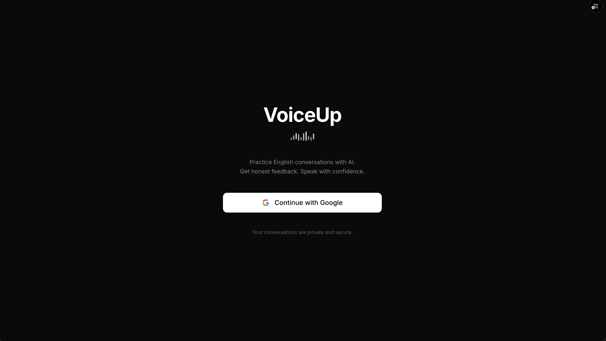
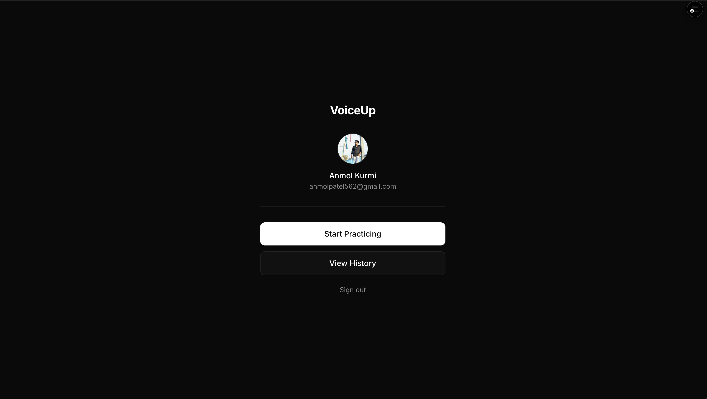
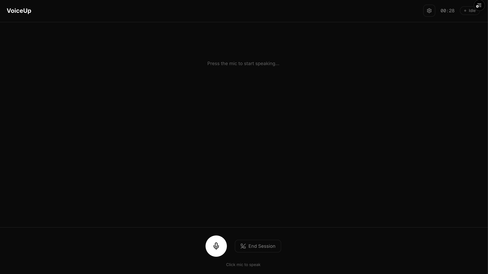
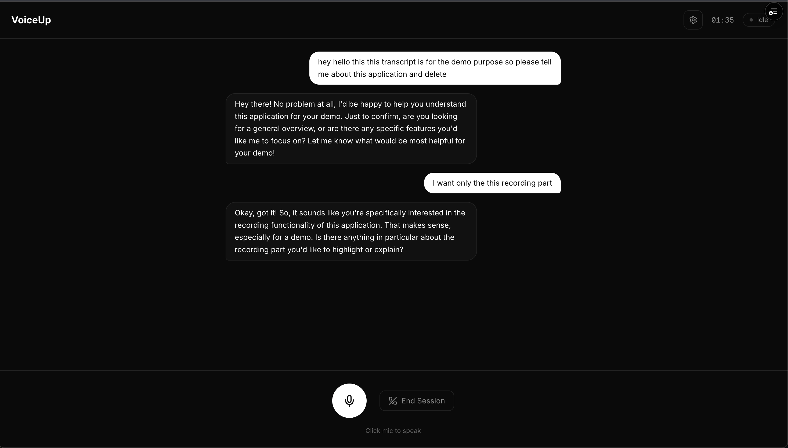
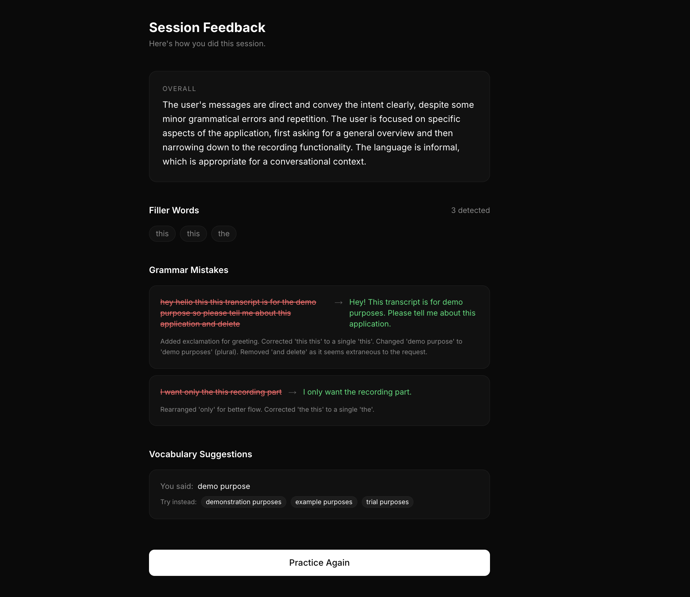
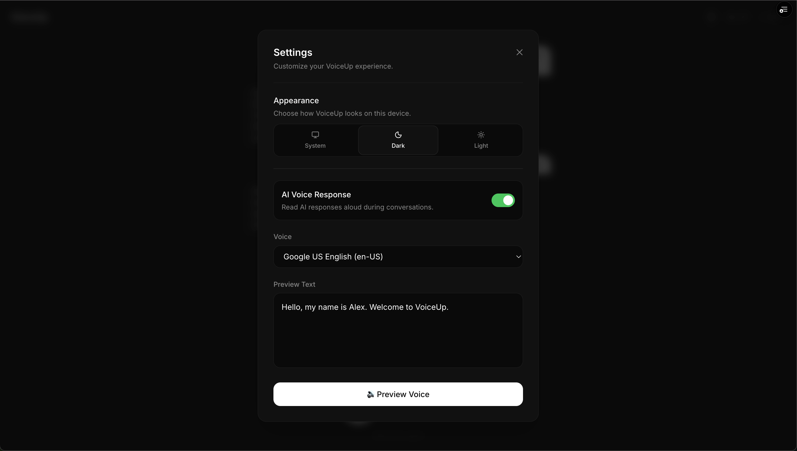

# VoiceUp

**AI-powered English speaking practice tool** — have real conversations with an AI partner and get honest feedback on your grammar, filler words, and vocabulary.

---

## What it does

Most people who know English struggle to speak it confidently. Existing apps are built for beginners learning from scratch. VoiceUp is built for people who already know English but freeze when speaking.

You open a session, speak freely with an AI conversation partner, and when you end the session you get a detailed feedback report:

- Grammar mistakes you made with corrections and explanations
- Filler words you used (um, like, basically) and how many times
- Vocabulary suggestions — better alternatives for weak word choices
- An honest overall assessment of your session

Your sessions are saved so you can track improvement over time.

---

## Tech Stack

## Screenshots

### Login Page


### LoggedIn User Page


### Session


### Recording


### Recording


### Settings



| Layer | Technology |
|---|---|
| Frontend | Next.js 16, TypeScript, TailwindCSS, Shadcn UI |
| Backend | Next.js API Routes |
| Database | PostgreSQL (Neon) + Prisma ORM |
| Auth | Google OAuth via NextAuth.js |
| AI | Google Gemini 2.5 Flash |
| Voice | Web Speech API (browser native) |
| Deployment | Vercel |

---

## Features

- **Google OAuth** — one-click sign in, no passwords
- **Real-time voice capture** — browser-native Web Speech API, no extra cost
- **AI conversation** — Gemini responds naturally to keep the conversation going
- **Real-time voice transcription** - 
- **Instant feedback** — grammar analysis, filler word detection, vocabulary suggestions
- **Session history** — every session saved with date, duration, and feedback
- **Dark UI** — clean, modern interface built for focus

---

## Architecture

```
/app
  /api
    /appSession       → POST (create session), GET (list sessions)
    /appSession/[id]  → PATCH (update duration)
    /message          → POST (save message)
    /conversation     → POST (Gemini conversation)
    /feedback         → POST (generate + save feedback)
    /feedback/[id]    → GET (fetch feedback)
    /auth/[...nextauth] → Google OAuth handler
  /home               → Dashboard
  /session            → Active practice session
  /history            → Past sessions
  /feedback/[id]      → Session feedback report

/lib
  prisma.ts           → Prisma client
  auth.ts             → NextAuth config
  gemini.ts           → Gemini client

/prisma
  schema.prisma       → DB schema
```

---

## Database Schema

```prisma
User         → stores Google profile
Session      → NextAuth auth sessions
AppSession   → practice session (duration, userId)
Message      → each message in a conversation (role, text, sessionId)
Feedback     → AI-generated feedback (grammar, fillerWords, vocabulary)
Account      → OAuth account linking
```

---

## How a session works

1. User clicks **Start Session** → `AppSession` created in DB
2. User clicks mic → Web Speech API starts recording
3. User clicks mic again → transcript captured
4. User message saved to DB immediately
5. Transcript sent to Gemini → AI responds
6. AI message saved to DB immediately
7. Steps 2–6 repeat for the entire conversation
8. User clicks **End Session** → duration saved, transcript sent to Gemini for feedback
9. Feedback saved to DB → user redirected to feedback page

---

## Getting Started

### Prerequisites

- Node.js 18+
- PostgreSQL database (Neon recommended)
- Google Cloud project with OAuth credentials
- Google AI Studio API key

### Installation

```bash
git clone https://github.com/Anmolpatel562/voiceup
cd voiceup
npm install
```

### Environment Variables

Create a `.env` file at the root:

```env
DATABASE_URL=your_neon_postgresql_connection_string
GOOGLE_CLIENT_ID=your_google_oauth_client_id
GOOGLE_CLIENT_SECRET=your_google_oauth_client_secret
NEXTAUTH_SECRET=your_nextauth_secret
NEXTAUTH_URL=http://localhost:3000
GEMINI_API_KEY=your_gemini_api_key
NEXT_PUBLIC_BASE_URL=http://localhost:3000
```

### Database Setup

```bash
npx prisma generate
npx prisma db push
```

### Run locally

```bash
npm run dev
```

Open [http://localhost:3000](http://localhost:3000)

---

## Deployment

This project is deployed on Vercel. Connect your GitHub repo to Vercel and add all environment variables in the Vercel dashboard. Update `NEXTAUTH_URL` and `NEXT_PUBLIC_BASE_URL` to your production URL.

Also add your production URL to **Authorized redirect URIs** in Google Cloud Console:
```
https://your-app.vercel.app/api/auth/callback/google
```

---

## Why I built this

I personally struggle with English speaking confidence — good at writing, but freeze when speaking. I built VoiceUp because I needed it myself. The best products come from real problems.

---

## Author

**Anmol Kurmi**
Full Stack Developer at Valuefy Technologies

[GitHub](https://github.com/Anmolpatel562) · [LinkedIn](https://linkedin.com/in/anmol-k-569197205)